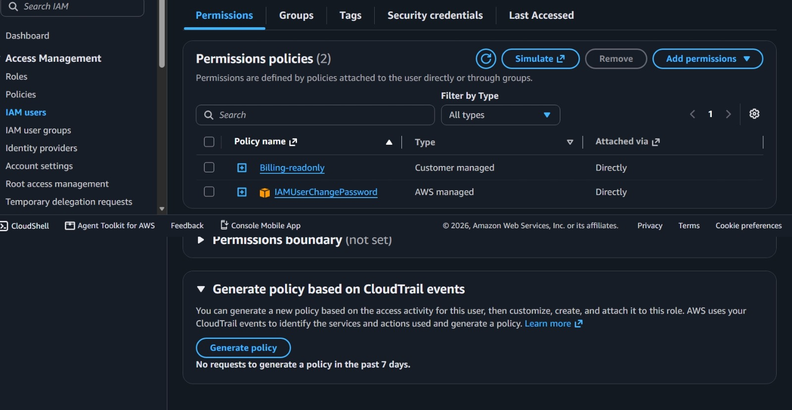
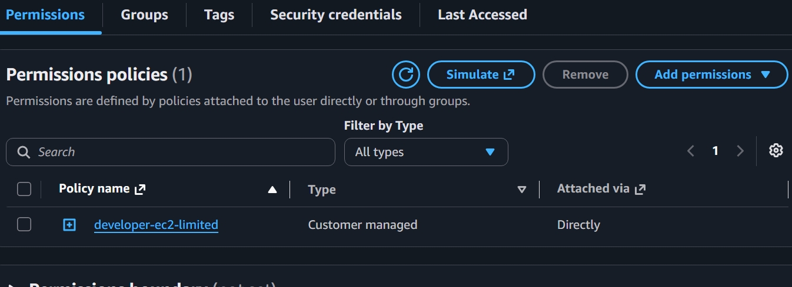

# IAM-least-privilege-p2-26-aug-26

## AWS IAM Least-Privilege Model - 3 Role Separation of Duties

Implemented secure IAM following principle of least privilege and separation of duties.

### 1. billing-user (Finance)
- Policy: `Billing-readonly`
- Scope: Billing read-only only. Cannot access EC2, S3, IAM.
- Why: Finance team should not manage infrastructure.

### 2. developer-user (Developer)
- Policy: `developer-ec2-limited`
- Scope: EC2 full access in us-east-1 only. Denied IAM & Billing.
- Why: Developers can build but cannot escalate privileges or view costs.

### 3. intern-user (Intern)
- Policy: `Intern-ReadOnly-S3`
- Scope: S3 read-only only.
- Why: Intern can learn from data but cannot delete/modify.

### Screenshots Proof

### Skills Demonstrated
- Custom IAM policies (JSON)
- Least privilege principle
- IAM user management
- Security best practices

Built: 26 Aug 2026 | AWS Free Tier | Accra, Ghana
